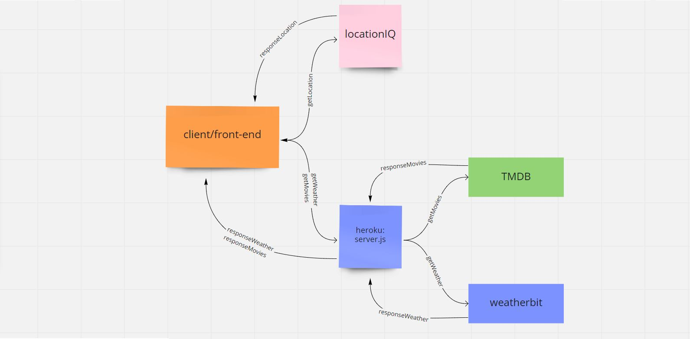

# City Explorer Api

**Author**: Ediberto Ponce
**Version**: 1.0.0 (increment the patch/fix version number if you make more commits past your first submission)

## Overview

- I built a React application that uses the Axios library to make user-initiated requests for data from a thrid-party API.

## Getting Started - Web Request-Response Cycle

## Architecture

- Express
- Axios
- Cors
- .env
- Nodeman

## Change Log

## Credit and Collaborations

- Dario Vitorte

## Name of feature: Custom Servers with Node and Express

- Estimate of time needed to complete: 8 hours
- Start time: 2:48pm
- Finish time: 9:45
- Actual time needed to complete: 9 hours

## Name of feature: Remote Server

- Estimate of time needed to complete: 8 hours
- Start time: 1:30pm
- Finish time: 11:10
- Actual time needed to complete: 10 hours
